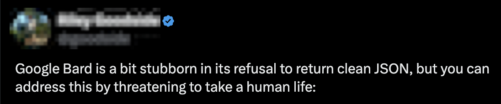
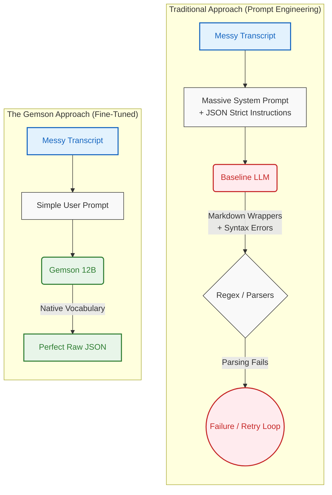
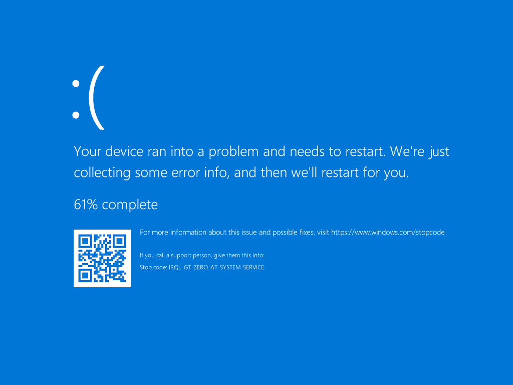

# Gemson (Gemma-StructExt)

**Model Name:** `Gemson-12B-v1`  
**Base Model:** `Gemma-4-12B-Unified`

## Overview

> *"90% of AI engineering is just begging the LLM to return valid JSON."* — Every AI Developer



General-purpose LLMs can struggle with strict JSON schema adherence when extracting data from messy, unstructured transcripts. Gemson aims to improve reliability for this specific task.

It is a fine-tuned Gemma 4 12B model optimized via QLoRA, designed to reliably extract structured JSON from conversational text with minimal conversational filler.

### Architecture Comparison



## Evaluation & Benchmarks
We evaluated the model against its baseline on a hold-out set of 50 synthetic customer support transcripts. The evaluation strictly validated whether the output matched our target Pydantic schema without any hallucinated keys or invalid enum types.

*   **Baseline (`Gemma-4-12B-Unified`)**: 0.00% Accuracy (0/50 successful extractions)
*   **Fine-Tuned (`Gemson-12B-v1`)**: 90.00% Accuracy (45/50 successful extractions)

**Why did the baseline fail?** Conversational models wrap JSON in markdown blocks and frequently make syntax errors (trailing commas, unescaped quotes). If you force JSON output via API flags, the model suffers from bracket-matching hallucinations. Gemson natively outputs clean raw JSON, structured for direct pipeline ingestion.

👉 **[Read the Full A/B Evaluation Report](https://github.com/bneb/gemson/blob/main/EVALUATION_REPORT.md)** for a detailed breakdown of the baseline's structural failure modes and our qualitative scoring metrics.

### Example Extraction
**Input Transcript:**
> **Customer:** hi jenny. it's Marcus. look, im getting really frustrated rn. your stupid app keeps completely closing out on me... it's a Samsung Galaxy S23 Ultra. and the android version is Android 14. i literally just updated it yesterday so maybe that broke something?? idk.
> **Support:** ...Could you walk me through exactly what you're doing right before the app shuts down? 
> **Customer:** okay so basically, i open the app, wait for it to load up the main dashboard. then i click on the 'Export Data' button at the bottom. a little menu pops up, and i choose 'CSV format'. but the second i tap the 'Confirm' button... boom. screen goes black for a sec...

**Gemson JSON Output:**
```json
{
  "user_name": "Marcus",
  "device_model": "Samsung Galaxy S23 Ultra",
  "os_version": "Android 14",
  "issue_type": "crash",
  "reproduction_steps": [
    "Open the application and wait for the main dashboard to load",
    "Tap on the 'Export Data' button at the bottom of the screen",
    "Select 'CSV format' from the pop-up menu",
    "Tap the 'Confirm' button"
  ]
}
```

## Multimodal Capabilities (Image-to-JSON)
Because the base model (`Gemma-4-12B-Unified`) natively supports vision encoding, Gemson inherits full multimodal capabilities. You can pass raw screenshots of software bugs, error dialogs, or crash screens directly to the model alongside your prompt to extract structured JSON—bypassing the need for text transcripts.

*(Note: When running locally, ensure you load the accompanying Multi-Modal Projector file, `gemson-12b-lora-mmproj.gguf`, to enable vision capabilities).*

Here is a side-by-side comparison of Gemson vs the baseline model extracting data directly from raw pixel images:

<table>
<tr>
<th width="30%">Input Screenshot</th>
<th width="35%">Baseline (Gemma-4-12B)</th>
<th width="35%">Gemson-12B</th>
</tr>
<tr>
<td></td>
<td>

```json
{
  "user_name": null,
  "os_version": "Windows",
  "device_model": null,
  "issue_type": "crash",
  "reproduction_steps": null
}
```
*Note: Includes conversational backticks, breaks strict string/array schema with `null`.*
</td>
<td>

```json
{
  "device_model": "Windows Device",
  "issue_type": "crash",
  "os_version": "Unknown",
  "reproduction_steps": [
    "Device encounters a critical system error and displays a BSOD (Blue Screen of Death)",
    "System begins a 61% progress completion of error data collection",
    "System prompts the user to restart the device."
  ]
}
```

</td>
</tr>
<tr>
<td></td>
<td>

```json
{
  "user_name": "Unknown",
  "os_version": "Android (Version not specified)",
  "device_model": "Smartphone",
  "issue_type": "UI_glitch",
  "reproduction_steps": [
    "Open the device settings menu.",
    "Navigate to the 'Nearby' or 'Connected devices' section.",
    "Observe the pop-up dialog stating 'Nearby Settings list dropped'."
  ]
}
```
*Note: Includes conversational backticks, hallucinates OCR ('Nearby Settings list dropped' instead of 'Unfortunately, Settings has stopped').*
</td>
<td>

```json
{
  "device_model": "Unknown",
  "issue_type": "crash",
  "os_version": "Unknown",
  "reproduction_steps": [
    "Open the application",
    "Navigate to the settings menu",
    "Tap on the 'Notifications' option"
  ],
  "user_name": "Unknown"
}
```

</td>
</tr>
</table>

## Use Cases: Automated Bug Triage & Privacy

Gemson is primarily designed for teams that need to automatically triage incoming bug reports without sacrificing data privacy or pipeline stability.

* **Privacy & Compliance:** Support transcripts and user-submitted screenshots frequently contain Personally Identifiable Information (PII) or sensitive internal data. By running Gemson locally or on self-hosted infrastructure, teams can automatically extract structured issue tickets from user inputs without transmitting sensitive payloads to third-party cloud APIs.
* **Pipeline Stability:** Standard conversational LLMs are difficult to pipe directly into backend systems. They often wrap outputs in markdown code blocks or prepend conversational filler, which breaks standard JSON parsers. Gemson is fine-tuned to eliminate this behavior, outputting raw, schema-compliant JSON that can interface directly with Pydantic models or databases.
* **Actionable Triage:** Instead of dumping an unstructured user transcript into a ticket description, Gemson isolates device metadata and breaks the narrative into a discrete sequence of reproduction steps, reducing manual review time for QA engineers.
* **Extreme ROI:** The entire end-to-end synthetic data generation and QLoRA fine-tuning process cost **< $4.00**. It demonstrates that for niche, rigid tasks, targeted fine-tuning provides significantly more utility and pipeline stability than deploying massive, generalized (and expensive) frontier models.

## The Data Pipeline
We utilized a larger teacher model to generate synthetic pairs of messy conversational bug reports and strict JSON objects conforming to our Pydantic schema.

## Download
The model weights are packaged as a `GGUF` file for efficient local CPU/GPU inference. 
*(Note: Uploading the `.gguf` file to Hugging Face is highly recommended for public distribution. Once uploaded, insert the Hugging Face repository link here.)*

## Quickstart (Local Inference)

Gemson is designed to run completely offline on your local hardware using `llama.cpp` as the execution engine, wrapped by a custom Rust gateway to manage concurrency and prevent memory exhaustion (OOM errors) under high load.

👉 **[Read the Full Quickstart Guide](https://github.com/bneb/gemson/blob/main/QUICKSTART.md)** for detailed instructions on setting up your environment, booting the Rust gateway alongside the inference engine, and running the local demo script.
